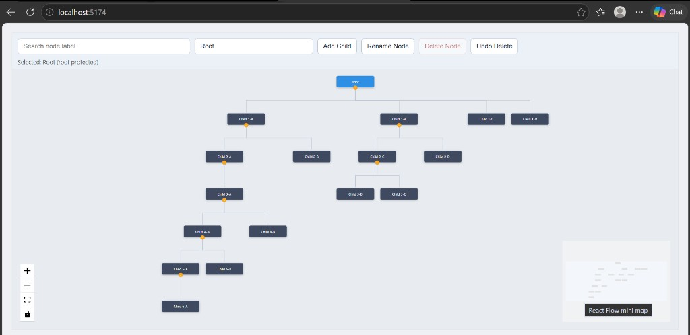

# Tree View (Task 4)

React Flow-based tree visualizer for hierarchical data.

## UI Preview



## Implemented Features

- Proper tree layout with computed sibling spacing
- Parent node centered above its visible children group
- Parent-child edge rendering
- Expand/collapse for nodes with children
- Automatic layout recalculation after expand/collapse
- Up to 6 levels depth in sample data
- Search + highlight (matching nodes highlighted, non-matching dimmed)
- Hover + selection styling
- Add child node
- Rename selected node
- Delete selected node (with confirmation prompt)
- Undo last deletion
- MiniMap + zoom/pan controls for larger trees

## Tech Stack

- React
- Vite
- React Flow

## Setup & Run

```bash
npm install
npm run dev
```

Open the local URL printed by Vite (default: `http://localhost:5173/`).

## Build

```bash
npm run build
```

## Usage

- Click a node to select it.
- Use toolbar actions for add, rename, delete, and undo delete.
- Use the search input to filter/highlight by node label.
- Collapse/expand any node using the small toggle button on the node.

## Notes

- Fully client-side implementation (no backend required).
- Layout uses recursive subtree width calculation to avoid overlap and keep parents centered.
